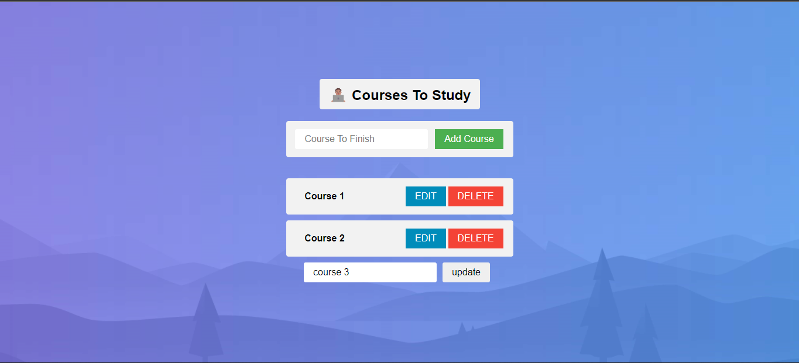

<p align="center">
  <h1 align="center"> Courses to study React App </h1>
  
</p>

[](https://github.com/fadyehabamer/ReactApp-CoursesToStudy/actions/workflows/ci.yml)


**Live demo:** https://react-app-courses-to-study.vercel.app

A to-study list for courses: add a course, edit its name inline, delete it
when you are done. The list is saved in the browser's `localStorage`
(key `savedCourses`), so it survives reloads. Built with React,
[Vite](https://vite.dev) and SweetAlert2 for the validation dialog.

## Getting started

Requires Node.js 22.13 or newer.

```bash
npm install
npm run dev      # dev server on http://localhost:3000
```

## Scripts

| Command | What it does |
| --- | --- |
| `npm run dev` / `npm start` | Start the Vite development server on http://localhost:3000 |
| `npm test` | Run the Vitest + Testing Library tests in watch mode; `npm test -- --run` runs them once |
| `npm run lint` | Lint with ESLint (`eslint.config.js`) |
| `npm run build` | Production build into `build/` |
| `npm run preview` | Serve the production build locally |

Deployed on Vercel; `vercel.json` selects the Vite preset and the `build/`
output folder.
